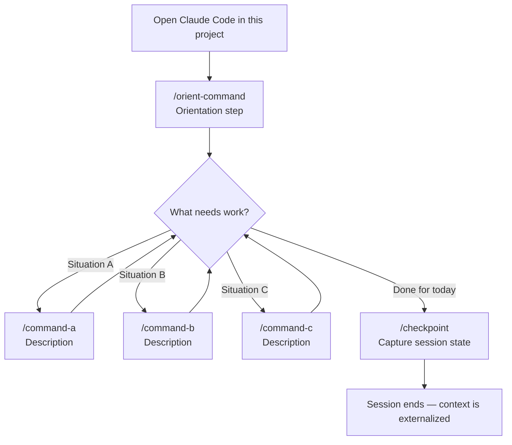
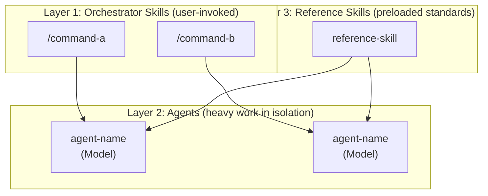

# Companion Guide: Integration Guide

How to create a companion-guide.md for a companion project. Follow this section order exactly — it is optimized for workbench rendering.

---

## The Definitive Section Order

```
1.  # Companion Guide                          ← Title + purpose line
2.  ## Command Quick Reference                 ← FIRST (workbench visibility)
3.  ## The Session Lifecycle                   ← Mermaid flowchart
4.  ### What the loop looks like in practice   ← Concrete examples
5.  ## [Core Workflow section(s)]              ← Phases, activities, modes
6.  ## When to Use Which Command              ← Situation-driven tables
7.  [Optional sections]                        ← Voice, authority, domains, etc.
8.  ## Agents                                  ← Three-layer architecture
9.  ## Key Files                               ← File reference table
10. ## Cross-Project Relationships             ← Connections to other projects
11. ## Key Principles                          ← 5-8 governing statements
12. **Last Updated**: [date]                   ← Currency stamp
```

---

## Section 1: Title + Purpose

One line. Always the same framing.

```markdown
# Companion Guide

How to use [companion name] to [primary activity]. This is the operational playbook — what to do, when, and which commands to use.

---
```

**Examples from existing companions:**

- "How to use the Software Architect companion to design and maintain architecture across Consortium tooling projects."
- "How to use the CAIO BaaS companion to shape a consulting practice."
- "How to use the SE Companion Workbench to implement architect-decomposed tickets."
- "How to use Project Creator to build AI companions through reverse prompting."

---

## Section 2: Command Quick Reference

Immediately after the title. This is the primary workbench content — visible in the right pane during active work.

### Template

```markdown
## Command Quick Reference

### [Activity Group 1]
```
/command                                          Description
/command [param]                                  Description with parameter
/command [param1] [param2]                        Full signature
```

### [Activity Group 2]
```
/command                                          Description
/command [param]                                  Description with parameter
```
```

### Grouping Conventions

Group commands by what the user is trying to do, not by implementation detail.

| Group Name Pattern | When to Use | Example |
|-------------------|-------------|---------|
| **Phase-based** | Companion has clear sequential phases | Setup, Seeding, Cultivation, Shaping |
| **Activity-based** | Companion has parallel activity types | Orientation, Design Work, Code Review, Session Management |
| **Rhythm-based** | Companion follows time-based patterns | Daily Operations, Weekly, Monthly |
| **Role-based** | Companion serves different modes | Spec Intake, Architecture Work, Code Review |

### Parameter Conventions

| Convention | Format | Example |
|-----------|--------|---------|
| Required parameter | `[param-name]` | `/ticket [CON-XXX]` |
| Optional parameter | `[param-name]` on a separate variant line | `/gaps` then `/gaps [client/companion]` |
| Flag | `--flag` before parameters | `/read-book --library [org] [url]` |
| Combined params | Space-separated on one line | `/intake [persona] [client/companion]` |

### Common Pattern: Global Override Parameter

If most commands accept a common override parameter (like `[client/companion]`), you can note it once instead of repeating on every line:

```markdown
## Command Quick Reference

> Most commands accept an optional `[client/companion]` override. Without it, they operate on the current companion.

### Seeding
```
/intake                                           Reverse prompting from scratch
/intake [persona]                                 Start with a known persona
```
```

---

## Section 3: Session Lifecycle

A Mermaid flowchart showing the full session arc.

### Template

```markdown
## The Session Lifecycle

Every interaction follows this arc. [One sentence about session cadence — episodic, daily, etc.]


```

### Style Rules

- **`flowchart TD`** for session lifecycles (top-down flow)
- **`stateDiagram-v2`** for phase/state transitions (when phases have sub-states)
- Node labels include the **command name** and a **brief description**: `"/brief\nSession orientation"`
- Edge labels describe the **trigger**: `"Architecture decision needed"`
- Diamond nodes for **decision points**: `PICK{What needs work?}`
- Always include **entry** (start) and **exit** (checkpoint) nodes
- Loop back to the decision node from each command to show the session cycle

---

## Section 4: What the Loop Looks Like in Practice

Immediately follows the lifecycle diagram. 5-7 concrete session examples.

### Template

```markdown
### What the loop looks like in practice

A typical session runs [N-M] commands before checkpointing. You might:

- `/orient` then `/command-a` to [do something], then `/checkpoint`
- `/orient` then `/command-b` a [specific thing], then `/checkpoint`
- `/command-c` reveals [finding], `/command-d` to [respond], then `/checkpoint`
- `/command-e` consolidates everything into [artifact], ready for `/command-f`

The loop is deliberate. Each command reads the current state of [tracking mechanism], so later commands in a session build on earlier ones.
```

### Quality Checklist

- [ ] Shows at least 5 different session patterns
- [ ] Covers varied paths through the lifecycle flowchart
- [ ] Names actual commands (not "run the orientation command")
- [ ] Each example is one line (one bullet)
- [ ] Shows realistic 2-4 command sessions, not theoretical marathons
- [ ] Ends with why the loop is deliberate (state builds on prior commands)

---

## Section 5: Core Workflow

How the companion organizes work. This varies by companion type.

### Pattern A: Phase-Based (most companions)

```markdown
## The Three Phases

### Phase 1: [Name] — [Purpose]

[1-2 sentences explaining the goal.]

| Situation | Command | What happens |
|-----------|---------|-------------|
| [Situation A] | `/command-a` | [Brief description] |
| [Situation B] | `/command-b` | [Brief description] |

### Phase 2: [Name] — [Purpose]

[1-2 sentences.]

| Command | What it produces |
|---------|-----------------|
| `/command-c` | [Output description] |

### Phase 3: [Name] — [Purpose]

[1-2 sentences.]

| Command | What it produces |
|---------|-----------------|
| `/command-d` | [Output description] |
```

### Pattern B: Activity-Based (companions with parallel workflows)

```markdown
## Core Workflow

The [companion] has [N] primary activities:

| Activity | Skill | Trigger | Output |
|----------|-------|---------|--------|
| **Orient** | /brief | Start of every session | Status presentation |
| **Design** | /design | Decision needed | Captured decisions |
| **Review** | /review | PR submitted | Structured review |

Supporting activities:

| Activity | Skill | Trigger | Output |
|----------|-------|---------|--------|
| **Research** | /research | Knowledge gap | Reference file |
| **Checkpoint** | /checkpoint | End of session | Session log entry |
```

### Pattern C: Ticket-Based (SE/implementation companions)

```markdown
## Command Reference

[N] workflow skills manage the implementation frame. The SE writes code directly — skills manage the process around that code.

| Command | Type | Description | When to Use |
|---------|------|-------------|-------------|
| `/brief` | Orchestrator | Session orientation | Start of every session |
| `/ticket [ID]` | Single | Start a ticket | Begin assigned work |
| `/review` | Orchestrator | Self-review | Implementation complete |
| `/done [ID]` | Single | Complete a ticket | Review passed |
```

---

## Section 6: When to Use Which Command

Situation-driven tables. The user looks up their situation and finds the command.

### Template

```markdown
## When to Use Which Command

### [Situation Category 1]

| Situation | Command |
|-----------|---------|
| [Concrete situation] | `/command [params]` |
| [Concrete situation] | `/command [params]` |

**`/command` [brief explanation of what it does and how it works.]**

### [Situation Category 2]

| Situation | Command |
|-----------|---------|
| [Concrete situation] | `/command [params]` |
```

### Quality Checklist

- [ ] Categories are based on user situations, not command groupings
- [ ] Each situation is concrete ("Meeting transcript from Granola"), not abstract ("raw input")
- [ ] Bold description after each table explains what the command does
- [ ] Covers the common "I'm not sure" case with a recommendation

---

## Section 7: Optional Sections

Insert after Core Workflow, before Agents. Include only those that apply.

### Voice / Named Behaviors

```markdown
## The [Companion] Voice

This is not a generic Claude conversation. The [companion]:

- **[Behavior name]** — [What it does]. [Example quote.]
- **[Behavior name]** — [What it does]. [Example quote.]
```

### Governing Principle

```markdown
## The Governing Principle

**[One-sentence principle.]** [2-3 sentences explaining what this means in practice and how it applies to every command.]
```

### Authority Boundaries

```markdown
## Authority Boundaries

| [This Companion] Owns | [This Companion] Does NOT Own |
|------------------------|-------------------------------|
| [Responsibility] | [Responsibility (owner)] |
```

### Development Workflows

Use Mermaid flowcharts for multi-phase build cycles. Include:
- The floor/iteration cycle
- Mid-build interrupt handling
- Post-build reconciliation
- A quick reference table mapping workflows to skill chains

---

## Section 8: Agents

Three-layer architecture diagram + agent table.

### Template

```markdown
## Agents

The companion uses a **three-layer architecture** for heavy analytical work:



| Agent | What It Does | Model | Reference Skills |
|-------|-------------|-------|-----------------|
| [agent-name] | [Purpose] | [Model] | [Skills or --] |

**Why agents?** [1-2 sentences explaining what would bloat the main context without agents.]
```

---

## Section 9: Key Files

File reference table with purpose and when-needed columns.

### Template

```markdown
## Key Files

| File | Purpose | When You Need It |
|------|---------|-----------------|
| `path/to/file.md` | [What it contains] | [When to read it] |
```

### What to Include

- Tracking files read by orientation commands
- Context files (requirements, constraints, decisions, questions)
- Build/progress files
- Reference library directories
- Architecture/design documents

---

## Section 10: Cross-Project Relationships

### Template

```markdown
## Cross-Project Relationships

| Project | Relationship |
|---------|-------------|
| **[Project Name]** | [How this companion relates — what flows in, what flows out] |
```

---

## Section 11: Key Principles

5-8 concise governing statements. Each starts bold with a verb phrase.

### Template

```markdown
## Key Principles

- **[Verb phrase].** [One sentence elaboration.]
- **[Verb phrase].** [One sentence elaboration.]
```

### Quality Checklist

- [ ] 5-8 principles (not more)
- [ ] Each starts with a bold imperative or declaration
- [ ] Each has exactly one sentence of elaboration
- [ ] Collectively they capture the companion's philosophy
- [ ] They are scannable — a returning user can refresh their mental model in 10 seconds

### Common Principles (adapt, don't copy)

These appear across multiple guides — adapt the framing to the companion's domain:

| Principle Pattern | Adaption Example |
|-------------------|-----------------|
| Externalize before you leave | "Run `/checkpoint` at the end of every session. Context lives in files, not conversation history." |
| Reverse prompt before producing | "The user's expertise is the primary input. Draw it out through questions, not assumptions." |
| When blocked, escalate | "Do not improvise, guess, or work around missing information." |
| Verify after agents claim completion | "Always do a final file inventory. Agents can claim success without delivering." |

---

## Section 12: Last Updated

```markdown
---

**Last Updated**: [Month Day, Year]
```

Always update this when commands change, new commands are added, or the guide structure is revised.

---

## Checklist: New Companion Guide

Use this when creating a companion-guide.md for a new companion:

- [ ] Title + purpose line follows the standard framing
- [ ] Command Quick Reference is the FIRST section after the title
- [ ] Every command variant has its own line with full parameter signature
- [ ] Commands are grouped by activity type (not alphabetical)
- [ ] Session Lifecycle has a Mermaid flowchart
- [ ] "What the loop looks like" has 5-7 concrete examples
- [ ] Core Workflow explains the organizing structure (phases, activities, or modes)
- [ ] "When to Use Which Command" has situation-driven tables
- [ ] Agents section has the three-layer diagram (if companion has agents)
- [ ] Key Files table is present
- [ ] Cross-Project Relationships table is present
- [ ] Key Principles has 5-8 concise statements
- [ ] Last Updated date is set
- [ ] Optional sections are included only where the domain warrants them

---

## Checklist: Updating Existing Companion Guide

Use this when updating a guide to match the standard:

- [ ] Command Quick Reference is repositioned as the FIRST section
- [ ] All command variants have parameter signatures (not just the base command)
- [ ] Section order matches the definitive order
- [ ] No sections are duplicated
- [ ] Last Updated date is refreshed
